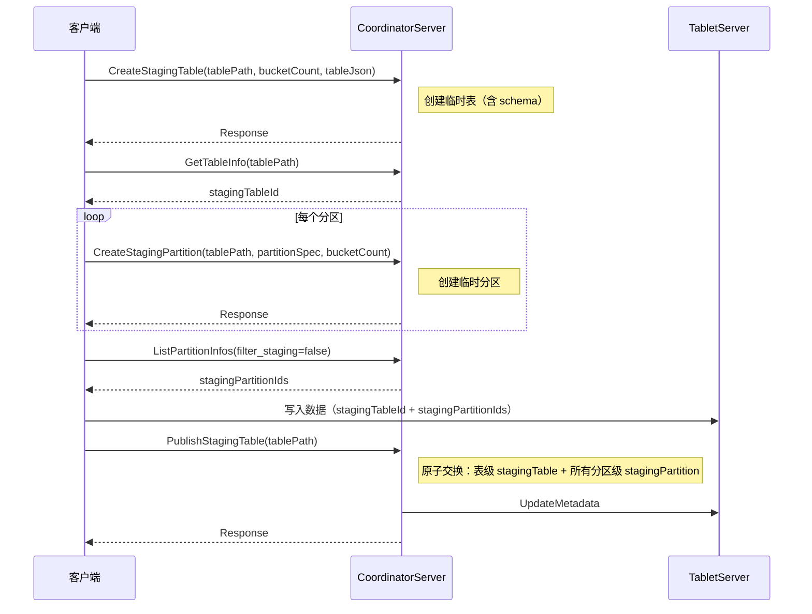

# 临时表/分区创建和 Publish 设计方案

## Motivation

在 Fluss 的数据湖/流处理场景中，存在两个核心需求：

1.  场景一：历史数据迁移。创建一张隐藏的临时表/分区，写入全部历史数据后交换为正式表/分区，在数据写入完成之前，临时表 / 分区对 ListTables / ListPartitionInfos 不可见，确保不会被 Source 发现、枚举，导致用户读到中间态数据。

2.  场景二：INSERT OVERWRITE 数据重刷。为已有正式表创建一个临时表/分区，重刷数据到临时表 / 分区后，执行 Publish ，正式表指向重刷后的新数据。


在本文中，场景一为无同名正式表的情况，场景二为有同名正式表的情况。

## Public Interfaces

### 1. 新增 RPC

本方案新增 **6 个** RPC：

| 新增 RPC | 用途 | Request 字段 |
| --- | --- | --- |
| CreateStagingTable | 创建临时表 | table\_path + optional table\_json + ignore\_if\_not\_exists |
| CreateStagingPartition | 创建临时分区 | table\_path + partition\_spec + ignore\_if\_not\_exists |
| DropStagingTable | 删除临时表 | table\_id + ignore\_if\_not\_exists |
| DropStagingPartition | 删除临时分区 | partition\_id + ignore\_if\_not\_exists |
| PublishStagingTable | 转正式表 | table\_id |
| PublishStagingPartition | 转正式分区 | partition\_id |

服务端根据 ZK 节点是否存在自动路由无同名/有同名正式表，客户端无需感知


#### CreateStagingTable

无同名正式表：table\_path + table\_json（完整表信息） 有同名正式表：table\_path（不需要 table\_json，共享字段从正式表继承）

```proto
message CreateStagingTableRequest {
    required PbTablePath table_path = 1;
    optional bytes table_json = 2;
    required bool ignore_if_exists = 3;
}

message CreateStagingTableResponse {
}


```

*   `table_path`：指定表名

*   `table_json`：无同名正式表时需要（完整表信息，含 schema/properties 等），有同名正式表时不需要（共享字段从正式表继承）

*   `ignore_if_exists`：与 CreateTableRequest 语义一致

*   服务端根据 ZK 节点是否存在自动路由：节点不存在→无同名正式表（创建新节点，从 table\_json 解析完整信息），节点已存在→有同名正式表（stagingTable 追加）


> **bucketLayoutEpoch 不需要客户端传**：创建临时表时服务端默认设为 0（初始值），只有发生 Rescale 时才递增。tableId/createdTime/modifiedTime 也由服务端生成。

#### CreateStagingPartition

有无同名正式表两种情况统一，字段相同。

```proto
message CreateStagingPartitionRequest {
    required PbTablePath table_path = 1;
    required PbPartitionSpec partition_spec = 2;
    required bool ignore_if_not_exists = 3;
}

message CreateStagingPartitionResponse {
}


```

*   `table_path`：指定表名

*   `partition_spec`：指定分区名（分区键值对）

*   `ignore_if_not_exists`：与 CreatePartitionRequest 语义一致

*   服务端根据 ZK 节点是否存在自动路由有无同名正式表两种情况


#### DropStagingTable

```proto
message DropStagingTableRequest {
    required int64 table_id = 1;
    required bool ignore_if_not_exists = 2;
}

message DropStagingTableResponse {
}


```

服务端根据 ZK 节点状态自动处理：

*   无同名正式表（顶层 tableId=-1）：删除整个 ZK 节点 + 临时表 TableAssignment + DFS 目录

*   有同名正式表：清空 stagingTable（setData）+ 删除临时表 TableAssignment + 临时表 DFS 目录


#### DropStagingPartition

```proto
message DropStagingPartitionRequest {
    required int64 partition_id = 1;
    required bool ignore_if_not_exists = 2;
}

message DropStagingPartitionResponse {
}


```

服务端根据 ZK 节点状态自动处理（同 DropStagingTable 逻辑）。

#### PublishStagingTable（表级）

```proto
message PublishStagingTableRequest {
    required int64 table_id = 1;
}

message PublishStagingTableResponse {
}


```

交换顶层与 stagingTable 的全部数据，通过一次 ZK `setData` 原子完成。有无同名正式表两个场景下本质是同一个操作，都是交换顶层与 stagingTable 的全部数据。

#### PublishStagingPartition（分区级）

```proto
message PublishStagingPartitionRequest {
    required int64 partition_id = 1;
}

message PublishStagingPartitionResponse {
}


```

交换顶层与 stagingPartition 的全部数据，通过一次 ZK `setData` 原子完成。

### 2. 现有 RPC 变更

#### Request 变更

| RPC | 新增字段 | 说明 |
| --- | --- | --- |
| ListTables | `optional bool filter_staging` | `filter_staging=true`（默认）不返回临时表，`false` 同时返回临时表 |
| ListPartitionInfos | `optional bool filter_staging` | `filter_staging=true`（默认）不返回临时分区，`false` 同时返回临时分区 |

> **注意**：GetTableInfo 和 MetadataRequest **不加** filter\_staging。GetTableInfo 是客户端主动指定表名查询，不会自动枚举，服务端发现有 stagingTable 自动返回。MetadataRequest 客户端用 table\_path 查询，服务端发现 stagingTable 存在时同时返回临时表的 metadata（含 bucket assignment），客户端按 tableId 匹配。CreateTable/CreatePartition **不改**（临时表/分区创建用新 RPC）。

#### Response 变更

| RPC | 新增字段 | 说明 |
| --- | --- | --- |
| GetTableInfoResponse | `optional StagingTableInfo staging_table` | 服务端发现有 stagingTable 自动返回 |
| ListTablesResponse | `optional StagingTableInfo staging_table` | `filter_staging=false` 时返回 |
| ListPartitionInfosResponse | `optional StagingPartitionInfo staging_partition` | `filter_staging=false` 时返回 |

#### 老客户端兼容

**filter\_staging 兼容：**

*   老客户端不发送 `filter_staging` 参数（proto2 optional，不发送时 `hasFilterStaging()=false`）

*   `hasFilterStaging()=false` → 服务端默认行为：不返回临时表/分区

*   新客户端发送 `filter_staging=false` → 返回正式 + 临时表/分区


**Response 新字段兼容：**

*   老客户端遇到 Response 中未知的 field number 自动忽略

*   新字段默认值为空，不影响老客户端


### 3. 元数据字段变更

#### TableRegistration 变更

*   新增 `stagingTable` 字段（`StagingTableRegistration` 类型，`@Nullable`）

*   `stagingTable` 为 `null` 表示无临时表

*   `stagingTable` 不为 `null` 时存储完整的临时表注册数据


#### StagingTableRegistration 结构

| 字段名 | 类型 | 说明 |
| --- | --- | --- |
| tableId | long | 临时表 tableId |
| bucketCount | int | 临时表 bucketCount |
| bucketLayoutEpoch | long | 桶布局 epoch |
| createdTime | long | 创建时间 |
| modifiedTime | long | 修改时间 |

> 以上字段与 `TableRegistration` 的差异字段相同，共享字段（`comment`、`partitionKeys`、`bucketKeys`、`properties`、`customProperties`、`remoteDataDir` 等）不存放在 `StagingTableRegistration` 中，临时表直接复用顶层 `TableRegistration` 的值。

#### PartitionRegistration 变更

*   新增 `stagingPartition` 字段（`StagingPartitionRegistration` 类型，`@Nullable`）

*   `stagingPartition` 为 `null` 表示无临时分区

*   `stagingPartition` 不为 `null` 时存储完整的临时分区注册数据


#### StagingPartitionRegistration 结构

| 字段名 | 类型 | 说明 |
| --- | --- | --- |
| partitionId | long | 临时分区 partitionId |
| bucketCountActual | int | 临时分区 bucketCountActual |

#### 反序列化兼容

*   旧版本 ZK 数据无 `stagingTable` / `stagingPartition` 字段，反序列化时默认为 `null`

*   新版本写入 `stagingTable=null` 等同于旧版本数据，向后兼容


## Proposed Changes

### A. ZK 元数据、Assignment、DFS 物理路径

本方案不改变现有 ZK 路径结构。为便于理解元数据布局，先给出完整结构。

以分区表 `db1.t1`（tableId=1001，分区 `p1` partitionId=2001）为例：

```plaintext
1. ZK 元数据树

/metadata/databases/
  └── {db}/tables/
            └──{tableName}                          # TableRegistration JSON: tableId、bucketCount、bucketLayoutEpoch、createdTime, modifiedTime 等
                  ├── schemas/{schemaId}            # Schema JSON (schemaId=1)
                  └── partitions/{partitionName}    # PartitionRegistration JSON: tableId, partitionId, bucketCountActual 等


2. TabletServer Assignment 树

/tabletservers/
  ├── tables/
  │   └── {tableId}                                 # TableAssignment JSON
  └── partitions/                                   
      └── {partitionId}                             # PartitionAssignment JSON


3. DFS 物理路径树

{dataDir}/{dbName}/
  └── {tableName}-{tableId}/                        # 表级目录, 例如 t1-1001/
      └── partitions/                                
          └── {partitionName}-{partitionId}/        # 分区级目录, 例如 p1-2001/


```

*   **ZK 元数据**：以逻辑名 `{tableName}`、`{partitionName}` 为 znode 名，节点数据存储注册信息。`/metadata/databases/{db}/tables/{tableName}` 存储 `TableRegistration`，其下 `/schemas/{schemaId}` 存储 `Schema`，`/partitions/{partitionName}` 存储 `PartitionRegistration`。

*   **TabletServer Assignment**：以 `tableId` / `partitionId` 为 znode 名，节点数据存储 bucket 到 TabletServer 的映射。`/tabletservers/tables/{tableId}` 存储 `TableAssignment`，`/tabletservers/partitions/{partitionId}` 存储 `PartitionAssignment`。

*   **DFS 物理路径**：以 `{tableName}-{tableId}` / `{partitionName}-{partitionId}` 为目录名。TabletServer 重启时从 ZK 元数据中获取 `tableId` / `partitionId`，拼出 DFS 目录路径，定位并恢复数据。


---

#### A.1 历史数据迁移（无同名正式表）

创建一张隐藏的临时表/分区，写入全部历史数据后交换为正式表/分区，无同名正式表，/tables/{tableName} 顶层 tableId=-1 表示无正式表，其余字段为默认值。stagingTable 中存完整的临时表注册数据。

**表级临时表交换为正式表**

publish 前后，/tables/{tableName} 节点数据：

```json
{
  "tableId": -1,
  "bucketCount": 0,
  ...
  "stagingTable": {
    "tableId": 1002,
    "bucketCount": 8,
    ...
  }
}


```
```json
{
  "tableId": 1002,
  "bucketCount": 8,
  ...
  "stagingTable": {
    "tableId": -1,
    "bucketCount": 0,
    ...
  }
}


```

**分区级临时分区交换为正式分区**

publish 前后，/partitions/{partitionName} 节点数据（stagingPartition 与第一层数据全部交换）：

```json
{
  "tableId": 1001,
  "partitionId": -1,
  "bucketCountActual": 0,
  ...
  "stagingPartition": {
    "partitionId": 2002,
    "bucketCountActual": 8,
    ...
  }
}


```
```json
{
  "tableId": 1001,
  "partitionId": 2002,
  "bucketCountActual": 8,
  ...
  "stagingPartition": {
    "partitionId": -1,
    "bucketCountActual": 0,
    ...
  }
}


```

**说明：**

*   stagingTable / stagingPartition 是对象字段，一张正式表/分区限制只能一个临时表/分区

*   stagingTable / stagingPartition 存储完整的临时表/分区注册数据（与顶层字段结构相同）

*   交换操作 = 交换顶层与 stagingTable / stagingPartition 的全部数据。交换后顶层变为正式表/分区数据，stagingTable / stagingPartition 变为默认值（tableId=-1 / partitionId=-1）


#### A.2 INSERT OVERWRITE（有同名正式表）

有同名正式表，为已有正式表创建临时表，重刷数据后执行 Publish。

**表级 Publish**

Publish 前后，/tables/{tableName} 节点数据：

```json
{
  "tableId": 1001,
  "bucketCount": 4,
  "bucketLayoutEpoch": 0,
  "createdTime": 1700000000,
  "modifiedTime": 1700000000,
  ...
  "stagingTable": {
    "tableId": 1002,
    "bucketCount": 8,
    "bucketLayoutEpoch": 0,
    "createdTime": 1700000010,
    "modifiedTime": 1700000010
  }
}


```
```json
{
  "tableId": 1002,
  "bucketCount": 8,
  "bucketLayoutEpoch": 1,
  "createdTime": 1700000010,
  "modifiedTime": 1700000010,
  ...
  "stagingTable": {
    "tableId": 1001,
    "bucketCountActual": 4,

    （删除）
    "bucketLayoutEpoch": 0,
    "createdTime": 1700000000,
    "modifiedTime": 1700000000 （因为是继承原表，暂不支持修改 staging 表属性）
  }
}


```

**分区级 Publish**

Publish 前后，/partitions/{partitionName} 节点数据：

```json
{
  "tableId": 1001,
  "partitionId": 2001,
  "bucketCountActual": 4,
  ...
  "stagingPartition": {
    "partitionId": 2002,
    "bucketCountActual": 8
  }
}


```
```json
{
  "tableId": 1001,
  "partitionId": 2002,
  "bucketCountActual": 8,
  ...
  "stagingPartition": {
    "partitionId": 2001,
    "bucketCountActual": 4
  }
}


```

**说明：**

*   Publish 操作 = 交换顶层与 stagingTable / stagingPartition 的全部数据

*   Publish 后，顶层指向重刷后的新数据（tableId=1002），stagingTable / stagingPartition 中存旧数据（tableId=1001）

*   共享字段（comment、partitionKeys、bucketKeys、properties、customProperties、remoteDataDir 等）不交换，因为临时表和正式表共享这些字段

*   Publish 是一次 ZK setData 操作，原子完成


#### A.3 获取临时表/分区元数据的方式

**临时表 tableId 获取：**

*   通过 `GetTableInfo` 获取（不需要 filter\_staging，服务端自动返回）

*   response 中 `staging_table` 字段返回临时表 tableId

*   客户端通过结构区分：顶层=正式表 tableId，`staging_table`\=临时表 tableId


**临时分区 partitionId 获取：**

*   通过 `ListPartitionInfos(filter_staging=false)` 获取

*   response 中 `staging_partition` 字段返回临时分区 partitionId


**临时表 bucket assignment 获取：**

*   通过 `MetadataRequest` 用 table\_path 查询（不需要 filter\_staging）

*   服务端发现 stagingTable 存在时，在 `repeated PbTableMetadata table_metadata` 中同时返回临时表的 metadata（含 bucket assignment），客户端按 GetTableInfo 拿到的临时 tableId 匹配


**临时分区 bucket assignment 获取：**

*   通过 `MetadataRequest` 用 partitions\_id（临时分区 ID）查询

*   服务端返回对应的 `PbPartitionMetadata`（含 bucket assignment）


### B. 临时表/分区创建流程

#### B.1 创建场景概览

|  | 非分区表 | 分区表 |
| --- | --- | --- |
| 无同名正式表 | CreateStagingTable(含 tableJson) → 写入 → PublishStagingTable | CreateStagingTable(含 tableJson) → CreateStagingPartition × N → 写入 → PublishStagingTable |
| 有同名正式表 | CreateStagingTable(不含 tableJson) → 写入 → PublishStagingTable | CreateStagingTable(不含 tableJson) → CreateStagingPartition × N → 写入 → PublishStagingTable |

无同名正式表和有同名正式表的区别仅在于 CreateStagingTable 是否传入 tableJson：无同名正式表需传入完整表信息（含 schema、properties 等）；有同名正式表共享字段从正式表继承，不需要 tableJson。分区创建（CreateStagingPartition）在两种情况下完全相同，服务端根据 ZK 节点是否存在自动路由。

#### B.2 时序图

以分区表（无同名正式表）为例（非分区表省略分区创建步骤，Publish 改用 PublishStagingTable）：



**非分区表**：客户端调用 CreateStagingTable 创建临时表（无同名正式表时传入 tableJson，有同名正式表时不传），通过 GetTableInfo 获取临时表 tableId，写入数据后调用 PublishStagingTable 交换。

**分区表**：在非分区表流程基础上，客户端对每个分区调用 CreateStagingPartition 创建临时分区，通过 ListPartitionInfos(filter\_staging=false) 获取临时分区 partitionId。写入数据后调用 PublishStagingTable，服务端在单个 ZK 事务中同时交换表级 stagingTable 和所有分区级 stagingPartition，原子完成。

### C. Publish 机制

无同名正式表和有同名正式表的 Publish 本质是同一个操作，交换顶层与 `stagingTable` / `stagingPartition` 的全部数据。表级用 `PublishStagingTable`，分区级用 `PublishStagingPartition`。

#### C.1 交换内容

Publish 交换的是顶层与 `stagingTable` / `stagingPartition` 的**差异字段**：

| 层级 | 交换的差异字段 | 不交换的共享字段 |
| --- | --- | --- |
| 表级 | `tableId`、`bucketCount`、`bucketLayoutEpoch`、`createdTime`、`modifiedTime` | `comment`、`partitionKeys`、`bucketKeys`、`properties`、`customProperties`、`remoteDataDir` |
| 分区级 | `partitionId`、`bucketCountActual` | 共享字段从表级继承 |

共享字段在 `stagingTable` / `stagingPartition` 中与顶层值相同，交换后无实际变化，只有差异字段交换后有实际变化。

Publish 前后，ZK 路径不变、DFS 目录不变、TableAssignment/PartitionAssignment 不变。TabletServer 通过 `tableId` / `partitionId` 间接定位 DFS 物理路径，交换后自动指向新数据。

#### C.2 表级 Publish

`PublishStagingTable(table_id)` 交换顶层与 `stagingTable` 的全部数据。非分区表只交换表级数据；分区表同时交换表级和所有分区级数据（详见 C.4）。

**ZK 事务（单节点 setData）：**

| 操作 | ZK 路径 | 说明 |
| --- | --- | --- |
| check | /coordinators/epoch | 校验当前 leader epoch（防脑裂） |
| setData | /metadata/databases/{db}/tables/{tableName} | 交换顶层与 stagingTable 的全部数据（带乐观锁版本号） |

一次 ZK multi-op（check + setData）原子完成。无同名正式表交换前顶层 `tableId=-1`，交换后顶层变为临时表的 `tableId`；有同名正式表交换前顶层有正式表数据，交换后顶层变为临时表数据，`stagingTable` 中存旧数据。

#### C.3 分区级 Publish

`PublishStagingPartition` 接受 `int64 partition_id`，交换顶层与 `stagingPartition` 的全部数据。

**ZK 事务（单节点 setData）：**

| 操作 | ZK 路径 | 说明 |
| --- | --- | --- |
| check | /coordinators/epoch | 校验当前 leader epoch |
| setData | /metadata/databases/{db}/tables/{tableName}/partitions/{partitionName} | 交换顶层与 stagingPartition 的全部数据（带乐观锁版本号） |

ZK 事务保持不变（check + 单个 setData）。

#### C.4 分区表批量 Publish

对于分区表 INSERT OVERWRITE，可能需要对多个分区同时做 Publish。**必须保证原子性**：所有分区要么全部 Publish 成功，要么全部不 Publish，避免部分分区 Publish 成功后 Source 读到不一致的数据。

**方案：**客户端调用 `PublishStagingTable(table_id)`，CoordinatorServer 在单个 ZK multi-op 事务中完成表级和所有分区级的 Publish**。**

以分区表 `t1` 有 3 个分区 `p1`、`p2`、`p3` 都需要 Publish 为例：

| 操作 | ZK 路径 | 说明 |
| --- | --- | --- |
| check | /coordinators/epoch | 校验当前 leader epoch |
| setData | /metadata/databases/{db}/tables/t1 | 交换表级 stagingTable（带乐观锁版本号，仅 stagingTable 存在时） |
| setData | /metadata/databases/{db}/tables/t1/partitions/p1 | 交换 p1 顶层与 stagingPartition（带乐观锁版本号） |
| setData | /metadata/databases/{db}/tables/t1/partitions/p2 | 交换 p2 顶层与 stagingPartition（带乐观锁版本号） |
| setData | /metadata/databases/{db}/tables/t1/partitions/p3 | 交换 p3 顶层与 stagingPartition（带乐观锁版本号） |

所有 setData 在同一个 multi-op 事务中提交，ZK 保证原子性：要么全部成功，要么全部失败。

**设计说明：**

*   客户端调用 `PublishStagingTable(table_id)`，CoordinatorServer 自动扫描该表下所有有 `stagingPartition` 的分区节点

*   CoordinatorServer 在单个 ZK multi-op 事务中完成表级 `stagingTable` 和所有分区级 `stagingPartition` 的交换（check + 多个 setData），ZK 保证原子性

*   如果表节点存在 `stagingTable`，同时交换表级数据，保证表级 `tableId`/`bucketCount` 与分区级 `partitionId` 的一致性

*   单分区 Publish 使用 `PublishStagingPartition`（详见 C.3）


### D. 并发与一致性

#### D.1 锁矩阵

| 操作 | 是否需要表级锁 | 说明 |
| --- | --- | --- |
| 创建临时表（无同名正式表） | 是 | 新建表，例如对同一表名发起 CreateStagingTable |
| 创建临时表（有同名正式表） | 否 | 在现有节点追加 stagingTable，ZK 乐观锁保护 |
| 创建临时分区 | 否 | 在现有/新分区节点追加 stagingPartition |
| DropStagingTable / DropStagingPartition | 否 | 清空 stagingTable / stagingPartition，删除 Assignment |
| Publish（表级，含分区表批量） | 否 | 仅交换 ZK 数据，不改 bucket 分配 |
| Publish（分区级） | 否 | 仅交换 ZK 数据，不改 bucket 分配 |

#### D.2 一致性保障

*   **epoch check**：所有写操作通过 `check(/coordinators/epoch)` 防止脑裂，旧 leader 的未完成事务会被新 leader 阻止

*   **乐观锁**：`setData` 携带 ZK data version，防止并发修改覆盖

*   **原子事务**：Publish 是 ZK multi-op 事务（check + setData），天然原子；分区表批量 Publish 的多个 setData 在同一个 multi-op 中提交，保证全部成功或全部失败

*   **单 staging 约束**：每张表/分区限制一个 `stagingTable` / `stagingPartition`，多个操作不会并发修改同一个 ZK 节点的同一个字段

*   **元数据推送**：TabletServer 通过 `UpdateMetadata` 推送刷新元数据缓存


#### D.3 边界情况

| 场景 | 处理方式 |
| --- | --- |
| 重复创建临时表（stagingTable 已有值） | 返回错误：已存在临时表 |
| Schema 不一致 | 临时表必须使用与正式表相同的 schema，有同名正式表创建时校验 |
| Coordinator failover | 新 leader 通过 epoch check 阻止旧 leader 的未完成事务 |
| 重复 Publish | Publish 后 stagingTable / stagingPartition 中存旧数据，再次 Publish 会交换回来。客户端应避免重复 Publish |
| 批量 Publish 中部分分区无 stagingPartition 或分区不存在 | 服务端校验失败，返回错误，整个批量事务不提交。ZK multi-op 原子性保证不会出现部分 Publish 成功 |
| 临时表上创建分区 | 允许。临时表的分区创建在 stagingPartition 中 |
| 删除有临时表的正式表 | 先检查 stagingTable，如果有临时表则拒绝删除，提示先删除临时表 |

## Compatibility, Deprecation, and Migration Plan

### 兼容性矩阵

| Coordinator | TabletServer | 客户端 | 临时表功能 | 风险 |
| --- | --- | --- | --- | --- |
| 老 | 老 | 老 | 不可用 | 无 |
| 新 | 新 | 新 | 可用 | 无 |
| 老 | 新 | 新/老 | 不可用，无新 RPC | 无 |
| 新 | 新 | 老 | 不可用，无新 RPC | 无（老客户端看不到临时表，服务端过滤） |
| 新 | 老 | 新/老 | 不可用 | 无（不使用临时表功能时无影响；使用时老 TabletServer 缺少临时表元数据，写入失败） |

### ZK 数据兼容

`TableRegistration` 新增 `stagingTable` 字段、`PartitionRegistration` 新增 `stagingPartition` 字段，均为 `@Nullable`，默认值为 `null`。老版本反序列化时跳过不认识的字段（Fluss proto/JSON 向前兼容），现有功能不受影响。新版本写入 `stagingTable=null` 等同于旧版本数据，无需数据迁移。

### RPC 兼容

**新增 RPC**（CreateStagingTable、CreateStagingPartition、DropStagingTable、DropStagingPartition、PublishStagingTable、PublishStagingPartition）：老客户端和老服务端不认识，不影响现有功能。

**现有 RPC 变更**：

*   ListTables / ListPartitionInfos 新增 `optional bool filter_staging`：老客户端不发送该字段，服务端默认不返回临时表/分区，行为不变

*   GetTableInfoResponse / ListTablesResponse / ListPartitionInfosResponse 新增 `staging_table` / `staging_partition` 字段：老客户端遇到未知 field number 自动忽略（proto2 向前兼容）


### 迁移计划

新字段有安全默认值，无需数据迁移。滚动升级不影响现有功能。

**升级顺序**：

1.  升级所有 CoordinatorServer（新协调器具备临时表能力，但此时不使用）

2.  升级所有 TabletServer（新 TabletServer 具备临时表处理能力）

3.  所有 TabletServer 升级完成后，开始使用临时表功能


**升级前提**：临时表/分区功能要求集群内所有组件完成升级后才能使用。

**兼容性保证**：

*   现有功能不受影响：新字段默认值安全（`stagingTable=null`），老版本反序列化跳过不认识字段

*   老客户端不受影响：不使用临时表功能时，老客户端看不到临时表（服务端过滤），不需要解析新字段


## Rejected Alternatives

### A. 独立 ZK 命名空间

优点：完全隔离。否决原因：状态切换/Publish 需要跨路径迁移数据（ZK 不支持 rename），事务复杂，schema 子树迁移困难。且临时表与正式表同名时路径冲突，需额外的命名转换机制。

### B. 独立 ZK 路径的临时表（引入 physicalName）

否决原因：新设计下临时表和正式表在**同一个 ZK 节点**，znode 名相同，DFS 目录靠 tableId 区分（`{tableName}-{tableId}/`），不需要引入 `physicalTableName` / `physicalPartitionName` 字段来解耦逻辑名与物理目录。旧方案需要 physicalName 是因为临时表在独立 ZK 路径，Publish 需要交换指针后仍能定位正确物理目录；新方案临时表就在父节点内，无需此字段。

## Alternatives

### C. 创建临时表、分区都走旧 RPC（CreateTable / CreatePartition）

优点：不新增 RPC，减少 API 变更。

原因：

*   CreateTable 的语义是"创建正式表"，复用创建临时表会导致语义混乱

*   需要在 CreateTableRequest 中新增 `is_staging` 等参数区分正式/临时，修改现有 RPC 比新增 RPC 风险更大（可能影响现有功能）

*   CreateTable 创建的表默认对 ListTables 可见，需要额外机制控制可见性

*   临时表创建逻辑因有无同名正式表而不同（新建 ZK 节点 vs 在现有节点追加 stagingTable 字段），复用同一 RPC 导致服务端逻辑分支复杂


### D. 无同名正式表走旧 RPC，有同名正式表走新 RPC CreateStagingTable

优点：无同名正式表场景复用现有 RPC，减少新 RPC 数量。

原因：

*   同一个操作（创建临时表）走不同 RPC，取决于是否有同名正式表，增加客户端复杂度

*   客户端需要先检查是否有同名正式表（如 TableExists），再决定走哪个 RPC，多一次 RPC 往返

*   无同名正式表时用 CreateTable 创建，需要标记为"非正式表"（如顶层 tableId=-1），语义不清晰

*   两种创建路径的元数据结构可能不一致，后续 Drop / Publish 操作需要统一处理，增加复杂度


### E. 表级和分区级 Publish 都走 alterTable RPC

优点：复用现有 alterTable RPC，不新增 Publish RPC。

原因：

*   alterTable 的语义是"修改表属性/schema"，Publish 是交换顶层与 stagingTable 的全部数据，语义不符

*   分区级 Publish 操作的是 `PartitionRegistration` 而非 `TableRegistration`，用 alterTable 语义不通

*   分区表批量 Publish 需要在单个 ZK multi-op 中同时交换表级和多个分区级数据，alterTable 的单节点 setData 框架不适用

*   alterTable 的后处理逻辑（schema 变更通知、Lake 表同步等）与 Publish 无关，复用会导致不必要的副作用


### F. 表级 Publish 走 alterTable RPC，分区级 Publish 走 alterPartition RPC

优点：表级和分区级分别用对应的 ALTER RPC，语义更匹配。

原因：

*   alterTable / alterPartition 的语义是"修改属性/schema"，Publish 是交换顶层与 stagingTable / stagingPartition 的全部数据，语义不符

*   分区表批量 Publish 需要在单个 ZK multi-op 中同时交换表级和多个分区级数据，alterTable 和 alterPartition 是两个独立 RPC，无法在单个事务中完成

*   PublishStagingTable / PublishStagingPartition 的语义更清晰：客户端一次请求传入所有需要 Publish 的分区，服务端在单个 ZK multi-op 中原子完成